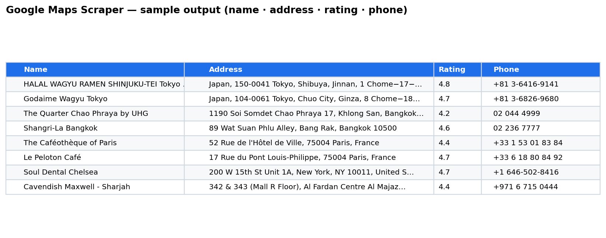

# 🗺️ Google Maps Scraper

A reusable Python + Selenium scraper that extracts business leads from Google Maps for **any keyword in any city or country** — no code changes required. Just set a keyword and a city, run, and get a clean Excel file.

Built to be **language-agnostic**: it returns correct addresses for Japan, Thailand, France, the USA, the UAE, and anywhere else, without country-specific hacks.



*Real output across 5 industries and 4 continents — see the `.xlsx` files in this repo.*

---

## ✨ What it extracts

For every place in the search results:

| Field | Example |
|-------|---------|
| **name** | `ibis Bangkok Siam` |
| **address** | `927 Rama I Rd, Wangmai, Pathum Wan, Bangkok 10330` |
| **rating** | `4.5` |
| **phone** | `+81 3-6380-4030` |

Output is saved as a ready-to-use `.xlsx` (Excel) file.

---

## 🚀 Quick start

```bash
pip install -r requirements.txt
```

Then open `Google_Maps_Reusable.ipynb` and:

1. **Cell 1–2** — install + import (run once)
2. **Cell 3** — set your search:
   ```python
   keyword      = "hotel"
   city         = "bangkok"
   scroll_times = 10          # more scrolls = more results
   ```
3. **Cell 4** — load the helper functions
4. **Cell 4.5** — *(optional)* run the built-in self-test (no browser needed)
5. **Cell 5** — run the scraper
6. **Cell 6** — export to Excel

That's it — only Cell 3 ever needs editing.

---

## 🌍 Sample output (included in this repo)

Five real datasets across **5 industries and 4 continents** (94 places total), all scraped with this exact code:

| File | Niche | City | Region | Rows |
|------|-------|------|--------|-----:|
| `restaurants_tokyo.xlsx` | Restaurants | Tokyo 🇯🇵 | Asia | 18 |
| `hotels_bangkok.xlsx` | Hotels | Bangkok 🇹🇭 | Asia | 18 |
| `coffee_shops_paris.xlsx` | Coffee shops | Paris 🇫🇷 | Europe | 18 |
| `dentists_new_york.xlsx` | Dentists | New York 🇺🇸 | North America | 18 |
| `real_estate_agencies_dubai.xlsx` | Real estate agencies | Dubai 🇦🇪 | Middle East | 22 |

**Data completeness:** name, address, and rating are filled for **100%** of rows across all five datasets. Phone is filled wherever the business actually lists one (e.g. most Paris cafés don't publish a phone number on Google Maps).

A `sample_preview.csv` (first 3 rows of each dataset) is also included so you can view the data format without Excel.

---

## 🛠️ How it's built (engineering notes)

This isn't a throwaway script — it's structured for reliability:

- **Smart waits, not fixed sleeps.** Uses Selenium `WebDriverWait` to wait for each element to actually load, instead of guessing with `time.sleep()`. Fast pages finish immediately; slow pages (e.g. hotels with a booking panel) get the time they need. This eliminated a bug where ~60% of hotel addresses came back empty.
- **Language-agnostic address cleaning.** A single carefully-scoped regex strips only true junk — emoji, icon-font characters (the map-pin glyph that renders as a `□`), and invisible variation selectors — while **preserving** real address characters like the Japanese postal mark `〒`.
- **Testable by design.** Parsing logic is split into pure functions (string in → string out), so it can be unit-tested **without opening a browser**. Cell 4.5 runs 13 assertions across 5 languages in under a second.
- **Resilient loop.** One bad place is skipped, not fatal — the run always completes and always closes Chrome (`try/finally`).
- **Anti-blocking basics.** Realistic user-agent and disabled automation flags to reduce the chance of being blocked.

---

## 📦 Requirements

- Python 3.9+
- Google Chrome installed
- Packages in `requirements.txt` (Selenium, webdriver-manager, pandas, openpyxl)

`webdriver-manager` downloads the matching ChromeDriver automatically — no manual setup.

---

## ⚖️ Notes & limitations

- Respects a polite, human-like pace (randomized delays). For large jobs, raise `scroll_times` gradually.
- Google occasionally changes its HTML; if results ever come back empty, only the CSS selectors in Cell 4 need updating (the parsing logic is unaffected).
- Intended for legitimate lead generation and market research. Please use within Google's Terms of Service and applicable laws.

---

## 👤 About

Built by a freelance developer specializing in **web scraping, data extraction, and automation**.
Need a scraper for a specific site, niche, or data field? I can customize this or build from scratch.
